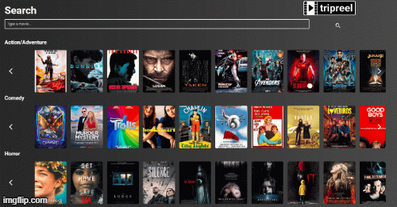

# 📽 Trip Reel Project

A mobile movie app that provides relevant movie information such as title, poster, runtime, plot, metascore, and where to watch. This app was built from scratch collaboratively with a team of six coders, which allowed us to learn agile development methodologies and implement feature and bug fixes using the git branch workflow and pull requests.

## Deployment

Deployed Website: https://tripreel.vercel.app/

## Built With

  - HTML
  - CSS
  - Foundation Framework
  - JavaScript
  - jQuery
  - Omdb API
  - Utelly API

